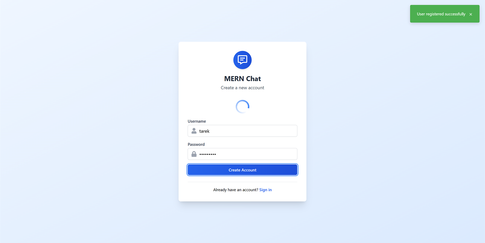

# MERN Chat Application

A real-time chat application built using the MERN stack (MongoDB, Express.js, React, Node.js) with Socket.IO for WebSocket communication and Tailwind CSS for styling.



## Features

- User authentication (Login/Register)
- Real-time 1-on-1 messaging
- Display online users
- Modern UI styled with Tailwind CSS

## Planned Features

- Group Chats
- File and Media Uploads

## Tech Stack

- **Frontend:** React, Tailwind CSS, Vite
- **Backend:** Node.js, Express.js
- **Database:** MongoDB (with Mongoose ODM)
- **Real-time Communication:** Socket.IO

## Project Structure

```
mern-chat-app/
├── api/            # Backend (Node.js/Express)
│   ├── controllers/
│   ├── models/
│   ├── routes/
│   ├── index.js
│   └── package.json
├── client/         # Frontend (React/Vite)
│   ├── public/
│   ├── src/
│   │   ├── components/
│   │   ├── context/
│   │   ├── pages/
│   │   ├── App.jsx
│   │   └── main.jsx
│   ├── index.html
│   ├── package.json
│   └── vite.config.js
└── README.md
```

## Setup and Installation

**Prerequisites:**

- Node.js and npm (or yarn)
- MongoDB instance (local or cloud-based like MongoDB Atlas)

**Backend Setup:**

1.  Navigate to the `api` directory:
    ```bash
    cd api
    ```
2.  Install dependencies:
    ```bash
    npm install
    # or
    # yarn install
    ```
3.  Create a `.env` file in the `api` directory and add your environment variables (e.g., MongoDB connection string, JWT secret):
    ```env
    MONGO_URL=your_mongodb_connection_string
    JWT_SECRET=your_jwt_secret
    PORT=8000
    CLIENT_URL=http://localhost:5173
    ```
4.  Start the backend server:
    ```bash
    npm start
    # or
    # yarn start
    ```
    The backend server should be running on the port specified in your `.env` file (default: 8000).

**Frontend Setup:**

1.  Navigate to the `client` directory:
    ```bash
    cd ../client
    ```
2.  Install dependencies:
    ```bash
    npm install
    # or
    # yarn install
    ```
3.  Start the frontend development server:
    ```bash
    npm run dev
    # or
    # yarn dev
    ```
4.  Open your browser and navigate to `http://localhost:5173` (or the port specified by Vite).
