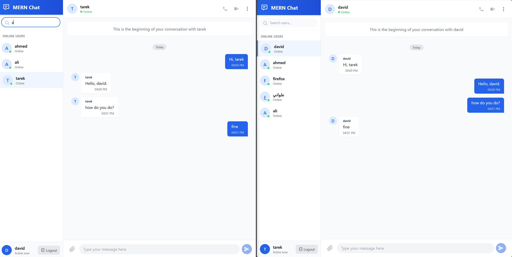

# MERN Chat Application

A real-time chat application built using the MERN stack (MongoDB, Express.js, React, Node.js) with Socket.IO for WebSocket communication and Tailwind CSS for styling.


## Features

- User authentication (Login/Register)
- Real-time 1-on-1 messaging
- Display online users
- Modern UI styled with Tailwind CSS
- Message history persistence
- Real-time typing indicators



## Planned Features

- Group Chats
- File and Media Uploads
- Message Reactions
- Read Receipts
- User Profiles with Customizable Avatars
- Dark Mode Support
- Voice and Video Calls
- End-to-End Encryption
- Message Search Functionality
- Offline Support (PWA)

## Tech Stack

- **Frontend:**

  - React 19 with Hooks
  - Tailwind CSS for styling
  - Vite for build tooling
  - Socket.IO Client for real-time communication
  - React Router for navigation
  - Axios for API requests

- **Backend:**
  - Node.js with Express.js
  - Socket.IO for WebSocket server
  - JWT for authentication
  - MongoDB with Mongoose ODM

## Project Structure

- **Backend:**
  - API routes are defined in the `server/routes` directory.
  - Controllers handle the business logic for each route.
  - Models define the data structure using Mongoose.
  - Socket.IO events are handled in the `server/controllers/socketController.js`.
- **Frontend:**
  - React components are located in the `client/src/components` directory.
  - Context providers are in the `client/src/context` directory.
  - Page components are in the `client/src/pages` directory.
  - Socket.IO events are handled in the `client/src/context/SocketContext.js`.

```
mern-chat-app/
├── server/            # Backend (Node.js/Express)
│   ├── controllers/   # Route controllers
│   ├── models/        # Mongoose models
│   ├── routes/        # API routes
│   ├── index.js       # Server entry point
│   └── package.json   # Backend dependencies
├── client/            # Frontend (React/Vite)
│   ├── public/        # Static assets
│   ├── src/
│   │   ├── components/  # Reusable UI components
│   │   ├── context/     # React context providers
│   │   ├── pages/       # Page components
│   │   ├── App.jsx      # Main application component
│   │   └── main.jsx     # Application entry point
│   ├── index.html       # HTML template
│   ├── package.json     # Frontend dependencies
│   └── vite.config.js   # Vite configuration
└── README.md            # Project documentation
```

## Setup and Installation

**Prerequisites:**

- Node.js (v16+) and npm (or yarn)
- MongoDB instance (local or cloud-based like MongoDB Atlas)

**Backend Setup:**

1.  Navigate to the `server` directory:
    ```bash
    cd server
    ```
2.  Install dependencies:
    ```bash
    npm install
    # or
    # yarn install
    ```
3.  Create a `.env` file in the `server` directory and add your environment variables:
    ```env
    MONGO_URL=your_mongodb_connection_string
    JWT_SECRET=your_jwt_secret
    PORT=8000
    CLIENT_URL=http://127.0.0.1:5173
    ```
4.  Start the backend server:
    ```bash
    npm start
    # or
    # yarn start
    ```
    The backend server should be running on the port specified in your `.env` file (default: 8000).

**Frontend Setup:**

1.  Navigate to the `client` directory:
    ```bash
    cd ../client
    ```
2.  Install dependencies:
    ```bash
    npm install
    # or
    # yarn install
    ```
3.  Start the frontend development server:
    ```bash
    npm run dev
    # or
    # yarn dev
    ```
4.  Open your browser and navigate to `http://127.0.0.1:5173` (or the port specified by Vite).
